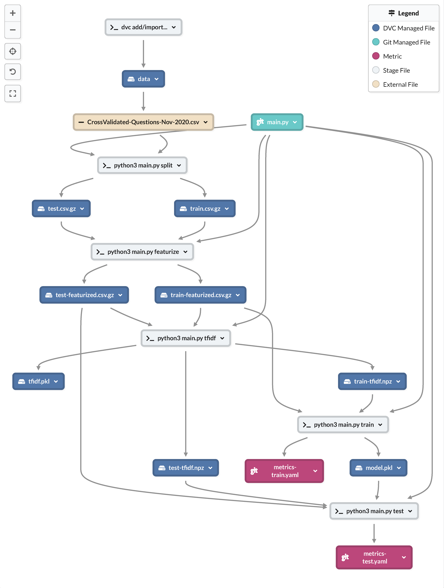
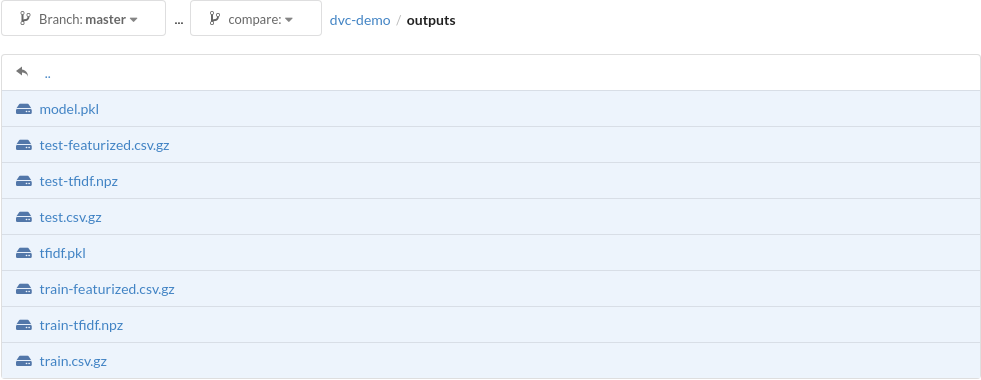

# DVC Demo Project

Demo project to test out DVC and DAGsHub

### See this repository on [DAGsHub](https://dagshub.com/arjvik/dvc-demo) and [GitHub](https://github.com/arjvik/dvc-demo)

[Data Version Control (DVC)](https://dvc.org/) is a version control system built around the machine learning workflow. It allows you to build and run pipelines, represented as a Directed Acyclic (dependency) Graphs, with data and code, tracking large outputs using Git-controlled metafiles. [DAGsHub](https://dagshub.com/) is a fully-featured Git and DVC remote, i.e. DAGsHub is to DVC as GitHub is to Git.

This repository implements a binary classifier on questions from CrossValidated Stack Exchange to determine if they are about machine learning or not. The machine learning portion of this repository is unremarkable and uses standard techniques. The python file `main.py` contains code for all steps of the ML pipeline.

```
Usage: python3 main.py [split|featurize|tfidf|train|test]
```

## View Experiment Log

The following command transforms the experiment log outputted by DVC into a human-readable format. It pipes the raw JSON outputted by DVC into a [`jq`](https://stedolan.github.io/jq/) program to transform it into a TSV (tab-seperated value) of metrics. The TSV is then piped to `column` to pretty-print it.

```bash
$ dvc metrics show --show-json --all-commits | jq -r '(["ID", "Train Accuracy", "Test Accuracy", "Train ROC AUC", "Test ROC AUC"] | ., map("=============")), (to_entries[] as {key: $id, value: {"metrics-train.yaml": $train, "metrics-test.yaml": $test}} | [$id[:10], $train.accuracy, $test.accuracy, $train.roc_auc, $test.roc_auc]) | @tsv' | column -tns$'\t'
```

Output:

```sql
ID              Train Accuracy      Test Accuracy   Train ROC AUC       Test ROC AUC
==============  ==============      ==============  ==============      ==============
workspace       0.9192533333333334  0.89608         0.9546657196819067  0.8611241864339614
8dbc9e261a      0.9192533333333334  0.89608         0.9546657196819067  0.8611241864339614
898fc3ba3a      0.9192533333333334  0.89608         0.9546657196819067  0.8611241864339614
1296fd461c      0.9185066666666667  0.8948          0.954678369966714   0.8550331715537685
75372d83ab      0.9195466666666666  0.89552         0.9541852826125495  0.8629513709508426
6a7e1866a3      0.9181866666666667  0.8964          0.9551873097990777  0.8595586812709163
ccceac7028      0.9192533333333334  0.89608         0.9546657196819067  0.8611241864339614
```

## DAGsHub Features

### Experiment Tracker


### Pipeline DAG



### DVC-tracked folder view (`outputs/`)



## Credits

- [DAGsHub Experiments Tutorial](https://dagshub.com/docs/experiment-tutorial/overview/)
- [DVC Getting Started - Data Pipelines](https://dvc.org/doc/start/data-pipelines)
- [DVC Command Reference](https://dvc.org/doc/command-reference)